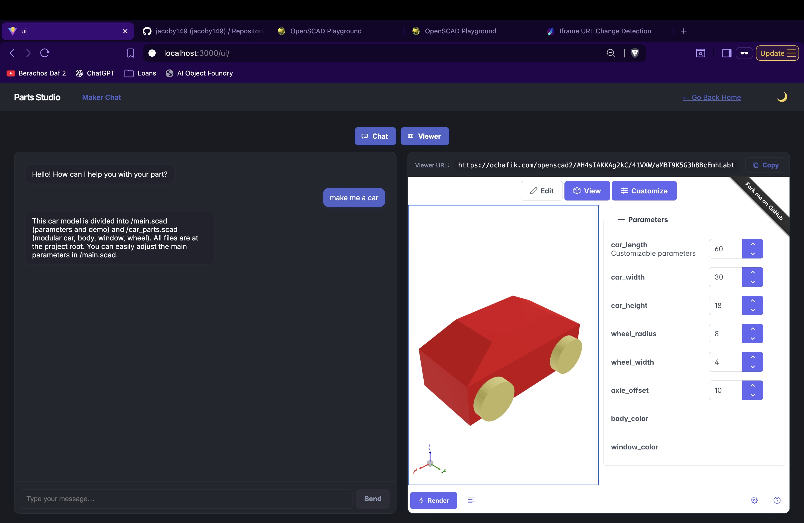

# Foundry

The chatbot that CADs, type what you want and it will build a 3D model for you! 

Anyone can run this locally, (don't need to know how to code!) instructions below! :)

### Instructions

1. Install Docker
2. Clone this project
3. copy the api/.env_example, make a file api/.env
   1. set your OPENAI_API_KEY from https://platform.openai.com/api-keys
4. Run **docker compose up --build**
5. Visit localhost:3000!

### Credits

<u>**This project uses**</u> 

[openscad]: https://github.com/openscad/openscad-playground

 by https://github.com/ochafik to visualize the outputted scad models!

